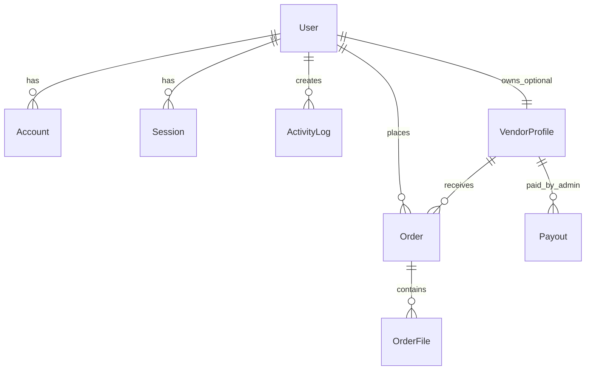

# AforPrint System Architecture Audit

This report documents how the current codebase works across Student, Vendor, and Admin roles, based on source analysis of `src/`, `prisma/`, root config, and production docs.

---

## SECTION 1 — PROJECT STRUCTURE

### 1.1 Top-level layout

- `src/app/` — Next.js App Router pages and server API routes.
- `src/components/` — role-specific and shared UI components.
- `src/lib/` — Prisma, payments, storage, rate-limit, and auth helper utilities.
- `src/auth.ts` + `src/auth.config.ts` — NextAuth/Auth.js setup, callbacks, role handling.
- `src/middleware.ts` — admin subdomain/path rewrite and gatekeeping logic.
- `prisma/schema.prisma` — canonical database schema.
- `docs/production/*` — architecture intent and deployment/security notes.
- `.env` — runtime secrets and platform configuration.

### 1.2 Frontend structure (App Router)

- Public
  - `src/app/page.tsx` — landing page.
  - `src/app/auth/login/page.tsx` — role-selection login entry.
  - `src/app/auth/role-sync/page.tsx` — post-login role synchronization.
- Student portal
  - `src/app/student/layout.tsx` — role guard + `StudentShell` wrapper.
  - `src/app/student/dashboard/page.tsx` — order summary.
  - `src/app/student/new-order/page.tsx` — upload/order/payment flow.
  - `src/app/student/orders/page.tsx` — status timeline + payment retry.
  - `src/app/student/profile/page.tsx`, `src/app/student/support/page.tsx`.
- Vendor portal
  - `src/app/vendor/layout.tsx` — role guard + shop lookup + `VendorShell`.
  - `src/app/vendor/dashboard/page.tsx`, `src/app/vendor/orders/page.tsx`.
  - `src/app/vendor/pricing/page.tsx`, `src/app/vendor/inventory/page.tsx`.
  - `src/app/vendor/settings/page.tsx`, `src/app/vendor/earnings/page.tsx`.
  - `src/app/vendor/analytics/page.tsx`, `src/app/vendor/support/page.tsx`.
- Admin portal
  - `src/app/admin/layout.tsx` — admin shell navigation.
  - `src/app/admin/login/page.tsx` — dedicated admin login UI.
  - `src/app/admin/dashboard/page.tsx`, `users/page.tsx`, `shops/page.tsx`.
  - `src/app/admin/orders/page.tsx`, `payouts/page.tsx` + client components:
    - `src/components/admin/AdminOrdersClient.tsx`
    - `src/components/admin/AdminPayoutsClient.tsx`
    - `src/components/admin/AdminUserStateAction.tsx`
  - `src/app/admin/files/page.tsx`, `logs/page.tsx`, `delivery/page.tsx`, `support/page.tsx`, `settings/page.tsx`.

### 1.3 Backend/API structure

All APIs are under `src/app/api/**/route.ts`:

- Auth/session: `api/auth/[...nextauth]`
- Role update: `api/user/role`
- Student: `api/student/vendors`, `api/student/orders`
- Upload: `api/upload/create`
- Order/payment: `api/order/create`, `api/payment/create`, `api/payment/verify`
- Vendor: `api/vendor/orders`, `api/vendor/order-status`, `api/vendor/pricing`, `api/vendor/inventory`, `api/vendor/settings`, `api/vendor/payouts`
- Admin: `api/admin/orders`, `api/admin/orders/status`, `api/admin/orders/notes`, `api/admin/payouts`, `api/admin/payouts/mark-paid`, `api/admin/vendors`, `api/admin/users/status`, `api/admin/metrics`

### 1.4 Runtime support files

- `src/lib/prisma.ts` — singleton Prisma client.
- `src/lib/payments.ts` — commission calculator + Razorpay signature verification.
- `src/lib/supabase-server.ts` / `src/lib/supabase-browser.ts` — storage clients + signed URL helpers.
- `src/lib/ratelimit.ts` — Upstash sliding-window limits.
- `src/types/next-auth.d.ts` — session/user role type augmentation.

---

## SECTION 2 — DATABASE ARCHITECTURE

Source: `prisma/schema.prisma`.

### 2.1 Tables/models

- `User`
  - Core identity + role (`STUDENT`, `VENDOR`, `ADMIN`), suspension flags, timestamps.
- `Account`, `Session`, `VerificationToken`
  - NextAuth adapter tables.
- `VendorProfile`
  - 1:1 with `User` (`userId @unique`), plus shop/config/inventory JSON fields.
- `Order`
  - Links student (`studentId -> User.id`) and vendor (`vendorId -> VendorProfile.id`).
  - Includes full financial breakdown and print specifications.
- `OrderFile`
  - 1:N child of `Order` with file metadata + storage URL.
- `Payout`
  - 1:N child of `VendorProfile` with payout status.
- `ActivityLog`
  - audit trail linked to `User`.

### 2.2 Relationship map

### 2.3 Notes on Users/Students/Vendors/Admin/Payments

- There is **no separate Student table**. A student is `User` with `role=STUDENT`.
- Vendor identity is split: `User(role=VENDOR)` + `VendorProfile`.
- Admin is also `User` (`role=ADMIN`) with allowlist override (`ADMIN_EMAILS`).
- Payment data is embedded in `Order` (`razorpayOrderId`, `razorpayPaymentId`, financial columns).

### 2.4 Broken/missing relationships

- No hard DB-level representation of delivery entities (driver, batch, route).
- No explicit support-ticket table; admin support page derives from disputed orders.
- Suspension (`User.isSuspended`) exists but not consistently enforced in route guards.

---

## SECTION 3 — AUTHENTICATION FLOW

### 3.1 Sign-in mechanism

- Provider: Google OAuth in `src/auth.config.ts`.
- Session strategy: JWT (`session.strategy = "jwt"`).
- NextAuth handler wired via `src/app/api/auth/[...nextauth]/route.ts`.

### 3.2 Session and role derivation

- In `src/auth.ts`:
  - `jwt` callback fetches current DB role by user id every auth cycle.
  - `session` callback places `id` and `role` into `session.user`.
  - `signIn` callback updates profile fields and logs LOGIN event.
  - `events.createUser` logs registration and auto-promotes allowlisted emails.
- In `src/auth.config.ts`:
  - fallback role logic sets `ADMIN` for allowlisted emails, else default `STUDENT`.

### 3.3 Role checks locations

- Layout/page guards:
  - `student/layout.tsx`, `vendor/layout.tsx`, all `admin/*` server pages.
- API guards:
  - nearly all routes check both session and role before DB operations.
- Middleware:
  - `src/middleware.ts` rewrites admin subdomain requests and rejects non-admin for admin-hosted paths.

---

## SECTION 4 — STUDENT FLOW

### 4.1 Signup/login

1. User opens `src/app/auth/login/page.tsx` and picks Student.
2. Google OAuth starts via `signIn("google", { callbackUrl: /auth/role-sync?role=student })`.
3. On callback, `src/app/auth/role-sync/page.tsx` calls `POST /api/user/role` with `role=STUDENT`.
4. Route `src/app/api/user/role/route.ts` updates `User.role` and logs `ROLE_UPDATED`.
5. User redirected to `/student/dashboard`.

### 4.2 Student profile creation

- No dedicated profile table creation step exists.
- Student identity is persisted in `User` record only.

### 4.3 Student order placement

1. `student/new-order/page.tsx` loads vendors from `/api/student/vendors`.
2. Upload init through `/api/upload/create` (signed upload token).
3. Client uploads to Supabase signed URL.
4. Creates order via `/api/order/create` with vendor + baseAmount + uploaded file metadata.
5. Initializes Razorpay order through `/api/payment/create`.
6. On Razorpay callback, verifies via `/api/payment/verify`.
7. Redirects to `/student/orders` for status timeline.

### 4.4 Broken/weak points in student flow

- If Supabase env vars are absent, upload returns `Storage not configured` and flow halts.
- Payment cannot complete if Razorpay keys are empty.
- `student/profile/page.tsx` uses localStorage-based logout rather than NextAuth `signOut`.

---

## SECTION 5 — VENDOR FLOW

### 5.1 Vendor onboarding

1. Login role selection picks Vendor in `auth/login/page.tsx`.
2. `role-sync` calls `POST /api/user/role` with `role=VENDOR`.
3. In `api/user/role`, if vendor profile missing, creates `VendorProfile` (`shopName` default: `Campus Print Vendor`).

### 5.2 Vendor data persistence

- Business settings: `/api/vendor/settings` updates `VendorProfile` columns.
- Pricing: `/api/vendor/pricing` stores JSON in `VendorProfile.pricingConfig`.
- Inventory: `/api/vendor/inventory` stores JSON in `VendorProfile.inventoryItems`.
- Payout stats: `/api/vendor/payouts` aggregates payouts + completed-order earnings.

### 5.3 Vendor dashboard + order intake

- Dashboard/orders pages fetch `/api/vendor/orders` (orders by `vendorProfile.id`).
- Order updates sent to `/api/vendor/order-status`.

### 5.4 Missing/broken logic

- UI allows `PAYMENT_PENDING -> ACCEPTED`, but API only allows `PAID -> ACCEPTED`.
- Vendor shell contains hardcoded admin URL `http://admin.localhost:3000/users`.

---

## SECTION 6 — ORDER SYSTEM

### 6.1 Lifecycle implementation

1. Student creates order (`/api/order/create`) with status `PAYMENT_PENDING`.
2. Payment creation (`/api/payment/create`) generates Razorpay order id and stores it.
3. Payment verification (`/api/payment/verify`) validates signature and marks order `PAID`.
4. Vendor updates through `/api/vendor/order-status`:
   - `PAID -> ACCEPTED|REJECTED`
   - `ACCEPTED -> READY|REJECTED`
   - `READY -> COMPLETED`
5. Student sees updates via `/api/student/orders` timeline UI.

### 6.2 Why orders may not appear in vendor dashboard

- Vendor must have a `VendorProfile`; otherwise `/api/vendor/orders` returns 404.
- Student must select that vendor id when creating order.
- Payment status mismatch can block vendor actions (orders visible but not actionable).
- If DB/pool connectivity is unstable, vendor list/orders fetch fails and UI may show empty state.

### 6.3 Design caveats

- `api/payment/create` only blocks `status===PAID`; other progressed statuses may be reset to `PAYMENT_PENDING`.
- Delivery fields (`deliveryAddress`, etc.) are minimally integrated and not tied to a true delivery subsystem.

---

## SECTION 7 — ADMIN DASHBOARD

### 7.1 Admin authentication

- Admin role comes from DB role and/or allowlist (`ADMIN_EMAILS`).
- Admin pages enforce role server-side and redirect to `/admin/login?next=...`.
- Middleware adds subdomain-based admin routing rules.

### 7.2 Admin data visibility

- Dashboard (`admin/dashboard/page.tsx`): aggregates orders, payouts, counts, top vendors.
- Users (`admin/users/page.tsx`): full user list with orders, provider, activity snapshots; suspend/reactivate action.
- Shops (`admin/shops/page.tsx`): vendor profiles + order volume.
- Orders (`AdminOrdersClient` + admin order APIs): search/filter, state changes, notes.
- Payouts (`AdminPayoutsClient` + admin payout APIs): create payout, mark paid.
- Files/logs/delivery/support/settings pages: mostly read-only analytics-style views; several controls are UI placeholders.

### 7.3 Analytics generation

- Primarily via Prisma aggregates/groupBy on `Order`, `Payout`, and `User`.
- `api/admin/metrics` exists but is not a central source for dashboard page rendering.

### 7.4 Missing admin capabilities

- No centralized CRUD for vendor verification/suspension.
- No true support ticket workflow (only disputed-order view).
- No actual execution behind many "admin tools" buttons (flush cache, profiler, etc.).
- File management UI has no deletion backend and uses raw `fileUrl` links.

---

## SECTION 8 — DATA FLOW ANALYSIS

### 8.1 Student → Order → Vendor

1. Student selects vendor from `VendorProfile` (`/api/student/vendors`).
2. Student creates `Order(studentId, vendorId, ...)` (`/api/order/create`).
3. Vendor fetches own orders by `vendorProfile.id` (`/api/vendor/orders`).

### 8.2 Vendor → Status → Student

1. Vendor patches order status (`/api/vendor/order-status`).
2. Student polling/fetch (`/api/student/orders`) reflects latest status.

### 8.3 Admin → System-wide control

1. Admin fetches cross-cutting data from admin pages/APIs.
2. Admin mutates user state (`/api/admin/users/status`), order state (`/api/admin/orders/status`), payout state (`/api/admin/payouts*`).
3. Mutations log into `ActivityLog` for audit feed.

### 8.4 Broken flow segments

- Vendor action flow breaks when order is `PAYMENT_PENDING` due to transition mismatch.
- Student upload flow breaks if Supabase env missing.
- Payment flow breaks if Razorpay keys missing.
- Admin file open flow can break with unresolved `sb://` URLs.

---

## SECTION 9 — BUGS AND ARCHITECTURE PROBLEMS

### CRITICAL ISSUES

1. Secrets in `.env` committed/used directly
   - DB/OAuth/Upstash secrets are present in local env file used in repo context.
   - Risk: credential leakage and account compromise.

2. Payment state regression risk
   - `api/payment/create` can set existing orders back to `PAYMENT_PENDING` unless already `PAID`.
   - Risk: lifecycle inconsistency and financial confusion.

3. Vendor status transition mismatch (UI vs API)
   - UI offers transitions from `PAYMENT_PENDING`; API forbids them.
   - Risk: operational deadlocks and vendor confusion.

### MAJOR ISSUES

1. Suspension not globally enforced
   - `User.isSuspended` toggled by admin, but route/layout guards do not deny suspended users.

2. Student profile/logout not integrated with auth session
   - `student/profile/page.tsx` uses localStorage cleanup instead of NextAuth signout.

3. Admin file links may be invalid for stored `sb://` URLs
   - File page opens `file.fileUrl` directly; does not call signed URL resolver.

4. Missing env fallback handling for storage/payment readiness in UI
   - Frontend flows fail late with generic errors if Supabase/Razorpay env is absent.

5. Hardcoded environment-specific admin URL in vendor nav
   - `VendorShell` uses `http://admin.localhost:3000/users`.

### MINOR ISSUES

1. Large number of placeholder metrics/actions in admin/vendor/student support/settings pages.
2. `api/admin/metrics` implemented but underutilized.
3. `src/lib/auth-helpers.ts` exists but not consistently adopted by routes.
4. Architectural docs in `docs/production` drift from current implementation details.

---

## SECTION 10 — FIX PLAN

### 10.1 Database fixes

1. Introduce migration discipline (Prisma migrations instead of ad-hoc push only).
2. Add optional normalized tables for:
   - Support tickets
   - Delivery batches/routes/events
3. Add indexes for high-frequency filters (`Order.status`, `Order.vendorId`, `ActivityLog.createdAt`).

### 10.2 API fixes

1. Align vendor status transitions between frontend and backend.
2. Prevent payment-create on non-payable states (`ACCEPTED`, `READY`, `COMPLETED`, etc.).
3. Enforce suspension checks in shared auth middleware/helper for all protected APIs.
4. Resolve admin file URLs through `resolveStoredFileUrl` before rendering links.
5. Standardize error envelope and include actionable error codes.

### 10.3 Frontend fixes

1. Replace localStorage logout in student profile with NextAuth `signOut`.
2. Remove hardcoded admin localhost link; use route constants/env-aware links.
3. Add explicit connectivity/config readiness banners (DB, Razorpay, Supabase) in dashboards.
4. Consolidate duplicate flow pages (legacy `student/order/page.tsx`) or retire unused pages.

### 10.4 Admin dashboard improvements

1. Build a unified data operations console (users/vendors/orders/payouts/files/logs).
2. Implement real actions behind placeholder buttons (or remove them).
3. Wire `api/admin/metrics` as single source for top-level KPI cards.
4. Add filter presets and export/audit tooling.

### 10.5 Testing strategy

1. API integration tests (role checks, transition rules, payout/order mutations).
2. End-to-end role journeys:
   - Student signup/login -> create order -> pay -> track
   - Vendor signup/login -> receive -> update status
   - Admin login -> moderate users -> manage payouts/orders
3. Contract tests for payment and storage adapters (mock Razorpay/Supabase).
4. Regression checks for DB connectivity/pooler config and env validation at startup.

---

## Quick architecture summary (for new engineers)

- The app is a Next.js monolith (UI + APIs) with Prisma/Postgres, Auth.js, Supabase Storage, and Razorpay.
- Role model is `User.role`; vendors additionally require `VendorProfile`.
- Orders are the core aggregate linking Student (`User`) and Vendor (`VendorProfile`).
- Admin control is implemented, but parts of admin/support/settings are still presentation-first and need functional completion.
- Most production risks are around lifecycle consistency, environment hardening, and incomplete enforcement of admin/suspension policies.
